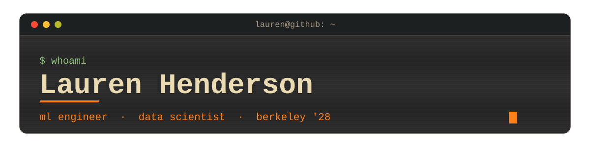

 

<!-- ============================================================= -->
<!-- TYPING SVG  —  greeting lines. To edit: change the phrases in   -->
<!-- lines= (semicolons separate them, + for spaces).               -->
<!-- ============================================================= -->

### `$ whoami`

Data Science student at **UC Berkeley**  working on applied machine learning for real-world, often high-stakes problems. Most recently an ML Engineer at the **National Geographic Society** and a Data Science Consultant for **UNICEF**. Currently VP of Sourcing for **Data Science Society @ Berkeley**.

### `$ cat projects.md`

#### Are Persona Vectors Language-Invariant?
Extended Anthropic's persona-vectors interpretability research across languages. Tested 3 traits (evil, sycophantic, hallucinating) in English and Spanish on Qwen2.5-3B-Instruct, finding **0.84-0.92 cross-language similarity** against a 0.45 cross-trait ceiling — evidence that persona directions are largely language-invariant. Validated with an LLM-judged steering evaluation (200 responses per condition); cross-language steering vectors matched same-language suppression and **cut hallucinations by up to 49%**.
`Python` · `PyTorch` · `Hugging Face` · `interpretability`
→ [github.com/LaurenMaiH/persona_vectors_language_variance](https://github.com/LaurenMaiH/persona_vectors_language_variance)

#### Marine Species Detection in Deep-Sea Footage · *National Geographic*
A multi-stage ML pipeline for automated marine-species detection and clustering, **cutting biodiversity annotation from 4+ months to 1-2 days**. Fine-tuned BioCLIP-2 across 36 configurations with a custom supervised contrastive loss for fine-grained species differentiation, improving cluster integrity from **60% to 96%**. Preprocessing (median blur, CLAHE, background gating) plus a YOLO-World VLM with ByteTrack tracking hit **100% recall** identifying individual animals with no pre-labeled data.
`Python` · `PyTorch` · `BioCLIP-2` · `YOLO-World` · `computer vision`
→ [github.com/seanli05/nat-geo](https://github.com/seanli05/nat-geo)

#### Agentic Sourcer Web Application
A multi-persona sourcing and enrichment tool built on the Apollo.io API with a Streamlit UI for filtering and managing contacts by company, role, seniority, and industry. Added automated email enrichment and verification, improving contact-data quality and cutting manual follow-up for Data Science Society recruiting.
`Python` · `Streamlit` · `Apollo.io API` · `LLM agents`
→ [github.com/LuisF1238/Apollo-Agent-v0.5](https://github.com/LuisF1238/Apollo-Agent-v0.5)

<!-- Spotted transformer-numpy in your VS Code - if that repo is public, it'd slot           -->
<!-- perfectly here as a "from-scratch transformer in NumPy" project. Add when ready:        -->
<!--                                                                                          -->
<!-- #### Transformer from Scratch (NumPy)                                                    -->
<!-- A full transformer - attention, encoder, decoder, positional encoding - implemented      -->
<!-- in pure NumPy to understand the architecture end to end.                                 -->
<!-- `Python` · `NumPy` · `from scratch`                                                      -->
<!-- → link                                                                                   -->

### `$ ls ~/experience`

**National Geographic Society** · ML Engineer *(Contract)* 
Feb 2026 – Jul 2026 
Designed and evaluated a multi-stage ML pipeline for automated marine-species detection and clustering in deep-sea footage. *(see Projects)*

**UNICEF** · Data Science Consultant *(Contract)* 
Sep 2025 – Dec 2025 
Built a full-stack RAG chatbot (LangChain, ChromaDB, Streamlit) with a 4-stage retrieval pipeline and persona-based prompting to adapt reports for children, researchers, policymakers, and humanitarian practitioners — with safety guardrails for age-appropriate, non-harmful responses.

**Data Science Society @ Berkeley** · VP of Sourcing, Social Good Committee 
Sep 2025 – Present 
Promoted from Consultant to VP of Sourcing; generated 30+ active partner leads and secured 5+ signed projects, including PG&E, Logitech, National Geographic, and the Smithsonian.

### `$ cat skills.txt`

### `$ neofetch`

<table>
<tr>
<td valign="top">
<pre>
   ______________
  |  __________  |
  | |          | |
  | |  LH  >_  | |
  | |          | |
  | |__________| |
  |______________|
      |______|
   ___/______\___
</pre>
</td>
<td valign="top">

**lauren@berkeley** 
`---------------------` 
**Music:** math rock, bon iver 🎸 
**Racing:** papaya on top 🏎️ 
**Reading:** demon copperhead 🐍 
**Tinkering:** keyboard modding (aula f75 + gateron milky yellows) ⌨️ 
**Out n About:** bouldering & hiking 🏔️ 
**Now playing:** *The Expanse*  🚀

</td>
</tr>
</table>

### `$ ./connect.sh`

<!-- Blog slot reserved - when you have 2-3 posts, add a "Writing" section here. -->

 
<code>// keep a little fire burning; however small, however hidden. </code>

